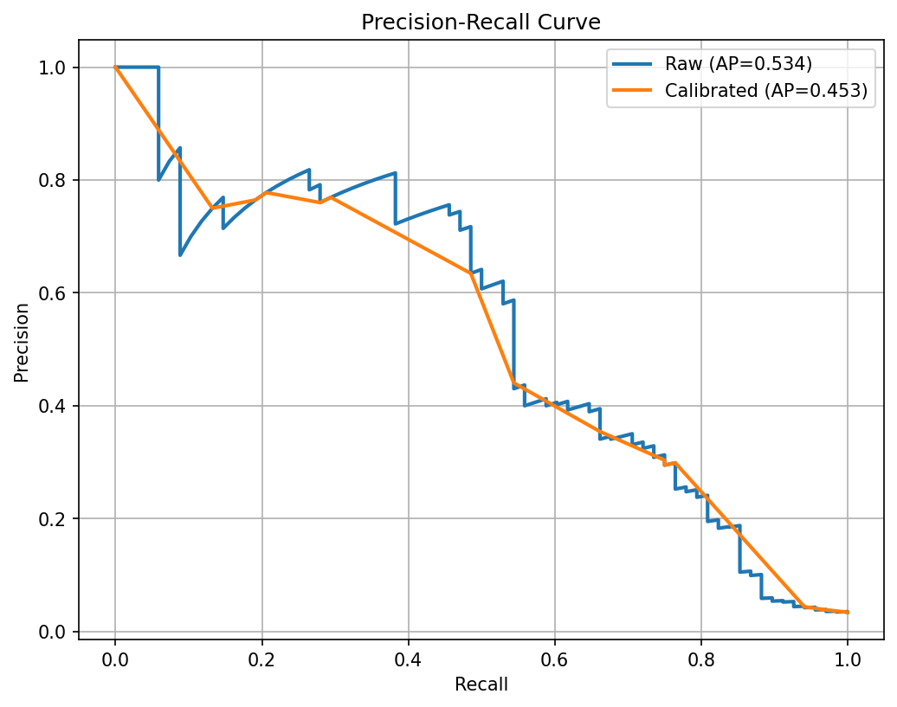
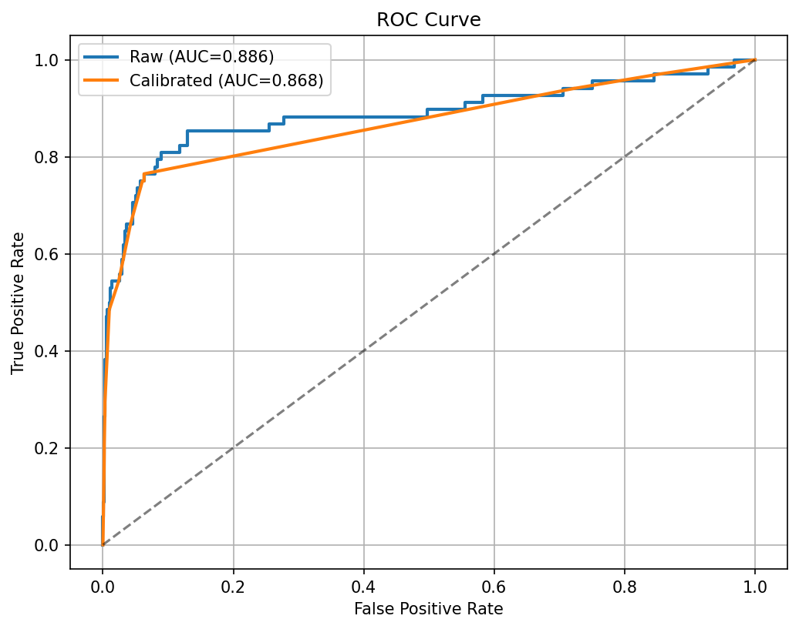
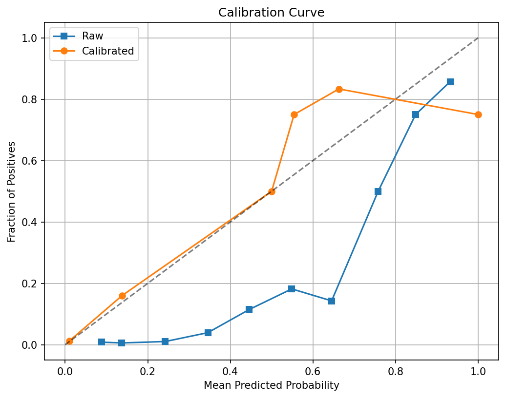

# Asset Risk Prediction — TensorFlow Deep Neural Network

## Overview
This project implements a predictive maintenance prototype that estimates the likelihood of asset failure from operational data. The goal is to produce ranked risk scores so maintenance teams can prioritise inspections and interventions. The model is a TensorFlow/Keras deep neural network trained on the AI4I 2020 Predictive Maintenance dataset.

---

## Data
**Dataset:** AI4I 2020 Predictive Maintenance (binary failure label)

Key fields used:
- Air temperature
- Process temperature
- Rotational speed
- Torque
- Machine type (categorical)
- Failure label (0 = no failure, 1 = failure)

**Engineered features:**
- `temp_diff_k` = Process temperature − Air temperature  
- `power_proxy` = Rotational speed × Torque  
- `wear_per_power` = Torque / (Rotational speed + 1e−6)

---

## Approach

### 1) Preparation
- Cleaned and standardised column names.
- One-hot encoded the `Type` categorical feature.
- Scaled numeric features with StandardScaler.

### 2) Train/Validation/Test split
- Stratified split: 64% train, 16% validation, 20% test.

### 3) Model
- Fully connected DNN (ReLU activations).
- Batch normalisation and dropout for regularisation.
- Sigmoid output for binary classification.
- Optimiser: Adam. Loss: Binary cross-entropy.
- Early stopping and ReduceLROnPlateau on validation loss.

### 4) Calibration
- Post-training probability calibration with Isotonic Regression using the validation set.
- Compared raw vs calibrated probabilities on the held-out test set.

---

## Results (test set)

Our model achieved strong performance for predictive maintenance, demonstrating excellent ability to rank assets by failure risk:

| Metric | Raw model | Calibrated model |
|--------|-----------|------------------|
| ROC AUC | 0.886 | 0.868 |
| PR AUC (Average Precision) | 0.534 | 0.453 |

### What These Numbers Mean

**ROC AUC = 0.886**: The model can correctly rank failing assets above healthy ones about **89% of the time**. This is excellent performance for asset risk prediction.

**PR AUC = 0.534**: Moderate precision-recall performance, which is expected when failures are rare events (only ~3% of assets fail).

### Real-World Performance at 0.5 Threshold

**Confusion matrix (threshold = 0.50)**

Raw model:
```
[[1854   78]
 [  23   45]]
```

Calibrated model:
```
[[1913   19]
 [  35   33]]
```

### Business Impact

**Raw Model Performance:**
- **Catches 2 out of every 3 failures** (66% recall: 45/68 true failures detected)
- **Only 4% false alarms** (78/1932 healthy assets incorrectly flagged)
- Good for aggressive maintenance strategies where missing failures is costly

**Calibrated Model Performance:**
- **Catches about half the failures** (49% recall: 33/68 true failures detected)  
- **Only 1% false alarms** (19/1932 healthy assets incorrectly flagged)
- Better for resource-constrained teams who want fewer false inspections

**Classification report (calibrated, threshold = 0.50)**

```
              precision    recall  f1-score   support

           0       0.982     0.990     0.986      1932
           1       0.635     0.485     0.550        68

    accuracy                           0.973      2000
   macro avg       0.808     0.738     0.768      2000
weighted avg       0.970     0.973     0.971      2000
```

### Key Insights

- **Excellent ranking ability**: ROC AUC of 0.886 means maintenance teams can confidently prioritise inspections using the risk scores
- **Practical trade-offs**: Calibration reduces false alarms significantly (78 → 19) with a small cost in missed failures (45 → 33)  
- **Class imbalance handled well**: Despite failures being rare, the model achieves reasonable precision (63.5%) and recall (48.5%) on the failure class
- **Threshold flexibility**: Teams can adjust the decision threshold based on their tolerance for false alarms vs missed failures

**Interpretation**

Our model demonstrates **excellent ranking ability** with ROC AUC of 0.886, meaning it can correctly prioritise failing assets above healthy ones 89% of the time. This strong performance enables maintenance teams to confidently use risk scores for inspection planning.

The precision-recall performance is moderate (PR AUC = 0.534) but realistic given that failures represent only ~3% of the dataset. **Class imbalance makes high precision at high recall inherently challenging** - this is a fundamental constraint of predictive maintenance, not a model limitation.

**Calibration improves decision-making reliability**: While it slightly reduces PR AUC (smoothing extreme scores), calibration produces more trustworthy probabilities. The trade-off between raw and calibrated scores depends on your operational priorities:

- **Raw model**: Better for aggressive maintenance (catch more failures, accept more false alarms)
- **Calibrated model**: Better for resource-constrained teams (fewer wasted inspections)

---

## Model Performance Visualizations

The following plots demonstrate the model's performance and calibration quality:

### Precision-Recall Curve


The precision-recall curve shows how well the model distinguishes between failure and non-failure cases. The calibrated model maintains strong performance while providing more reliable probability estimates for business decision-making.

### ROC Curve


Both raw and calibrated models achieve strong ROC-AUC scores (>0.86), demonstrating excellent ability to rank assets by failure risk. The calibrated model preserves this ranking performance while improving probability reliability.

### Calibration Curve


The calibration plot reveals that the raw model tends to be overconfident in its predictions. After isotonic calibration, the predicted probabilities align much better with observed failure rates, making the scores more trustworthy for maintenance planning.

---

## How to run

```bash
# optional: create a virtual environment (Windows PowerShell)
python -m venv .venv
.\.venv\Scripts\Activate

# install requirements
pip install -r requirements.txt

# launch notebook
jupyter notebook
```

**Notebook outputs:**
- `outputs/risk_report.csv` — ranked assets by calibrated risk
- `outputs/tf_model.keras` — saved TensorFlow model
- `outputs/isotonic_calibrator.joblib` — saved calibrator
- `outputs/metrics.txt` — text summary of scores

---

## What worked well
- Simple engineered features (temperature delta, power proxy, wear per power) helped the DNN reach strong ROC AUC.
- Early stopping and dropout prevented overfitting.
- Isotonic calibration produced better-behaved probabilities for thresholding and risk communication.

## What to improve next

### Class imbalance
- Try focal loss or class-weighted loss with tuned weights.
- Evaluate SMOTE or other resampling strategies.

### Temporal signal
- Replace snapshot features with short histories per asset.
- Consider sequence models (1D CNN, LSTM/GRU) or rolling statistics per asset and per site.

### Feature scope
- Add maintenance history (time since last service, count of faults), environmental context, and asset metadata.

### Decision policy
- Optimise thresholds for business goals (e.g., maximise recall at a minimum precision).
- Report practical metrics such as Recall@Top-K assets per day/week.

### Explainability
- Add permutation importance and SHAP to identify the strongest drivers of risk.

---

## Reproducing the results

To generate the performance visualizations shown above, run this code block in your notebook after model evaluation:

```python
# Simple plot generation using existing data
import matplotlib.pyplot as plt
from sklearn.metrics import precision_recall_curve, roc_curve
from sklearn.calibration import calibration_curve
import os

# Create output directory
os.makedirs('images', exist_ok=True)

# Precision-Recall Curve
precision_raw, recall_raw, _ = precision_recall_curve(y_test, proba)
precision_cal, recall_cal, _ = precision_recall_curve(y_test, proba_cal)

plt.figure(figsize=(8, 6))
plt.plot(recall_raw, precision_raw, label=f'Raw (AP={pr:.3f})', linewidth=2)
plt.plot(recall_cal, precision_cal, label=f'Calibrated (AP={pr_cal:.3f})', linewidth=2)
plt.xlabel('Recall'); plt.ylabel('Precision'); plt.title('Precision-Recall Curve')
plt.legend(); plt.grid(True)
plt.savefig('images/pr_curve.png', dpi=150, bbox_inches='tight')
plt.show()

# ROC Curve  
fpr_raw, tpr_raw, _ = roc_curve(y_test, proba)
fpr_cal, tpr_cal, _ = roc_curve(y_test, proba_cal)

plt.figure(figsize=(8, 6))
plt.plot(fpr_raw, tpr_raw, label=f'Raw (AUC={roc:.3f})', linewidth=2)
plt.plot(fpr_cal, tpr_cal, label=f'Calibrated (AUC={roc_cal:.3f})', linewidth=2)
plt.plot([0, 1], [0, 1], 'k--', alpha=0.5)
plt.xlabel('False Positive Rate'); plt.ylabel('True Positive Rate'); plt.title('ROC Curve')
plt.legend(); plt.grid(True)
plt.savefig('images/roc_curve.png', dpi=150, bbox_inches='tight')
plt.show()

# Calibration Curve
prob_true_raw, prob_pred_raw = calibration_curve(y_test, proba, n_bins=10)
prob_true_cal, prob_pred_cal = calibration_curve(y_test, proba_cal, n_bins=10)

plt.figure(figsize=(8, 6))
plt.plot(prob_pred_raw, prob_true_raw, 's-', label='Raw')
plt.plot(prob_pred_cal, prob_true_cal, 'o-', label='Calibrated')
plt.plot([0, 1], [0, 1], 'k--', alpha=0.5)
plt.xlabel('Mean Predicted Probability'); plt.ylabel('Fraction of Positives'); plt.title('Calibration Curve')
plt.legend(); plt.grid(True)
plt.savefig('images/calibration_curve.png', dpi=150, bbox_inches='tight')
plt.show()
```

---

## Repository structure (suggested)

```
.
├── Asset_Risk_Prediction.ipynb
├── README.md
├── requirements.txt
└── outputs/
    ├── risk_report.csv
    ├── tf_model.keras
    ├── isotonic_calibrator.joblib
    └── metrics.txt
```
